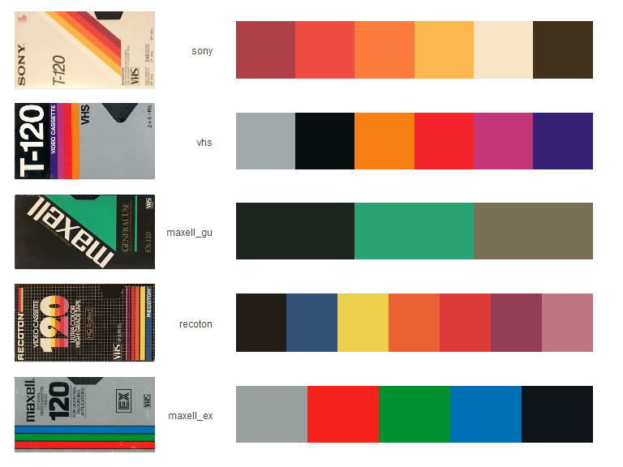
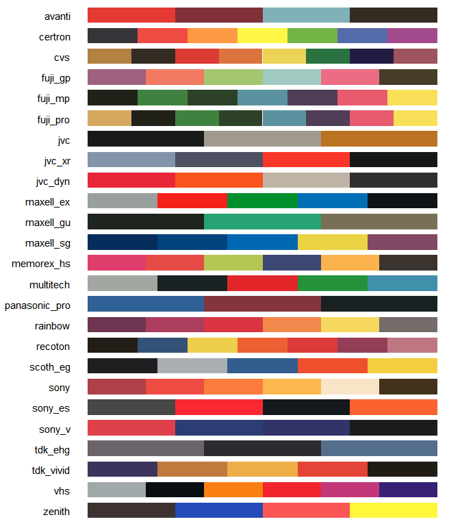
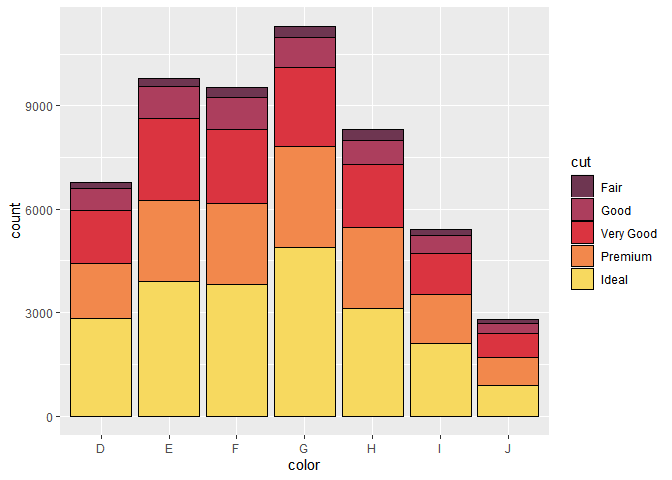

<!-- README.md is generated from README.Rmd. Please edit that file -->

# vhs

Colour palettes based on blank VHS cassette packaging design.

The inspiration and images for the colour palettes came from
[flashbak.com](https://flashbak.com/blank-vhs-cassette-packaging-design-trends-art-402545/)

### Examples

<!-- -->

``` r
library(vhs)
```

### View all palettes

``` r
view_all_vhs_palettes()
```

<!-- -->

### Get a single palette

Extract a single palette with `vhs()`

``` r
vhs("tdk_vivid") %>% 
  tibble(x=.) %>%
  mutate(x=fct_inorder(rev(x))) %>%
  ggplot() +
  geom_bar(aes("", fill=x), position = "stack") +
  scale_fill_identity()+
  theme_void()+
  coord_flip()
```

<!-- -->

``` r

vhs("tdk_vivid", type="c", n=40) %>% 
  tibble(x=.) %>%
  mutate(x=fct_inorder(rev(x))) %>%
  ggplot() +
  geom_bar(aes("", fill=x), position = "stack") +
  scale_fill_identity()+
  theme_void()+
  coord_flip()
```

<!-- -->

### ggplot

``` r
ggplot(diamonds, aes(color, fill=cut))+
  geom_bar(col=1)+
  scale_fill_manual(values = vhs("rainbow"))
```

<!-- -->
